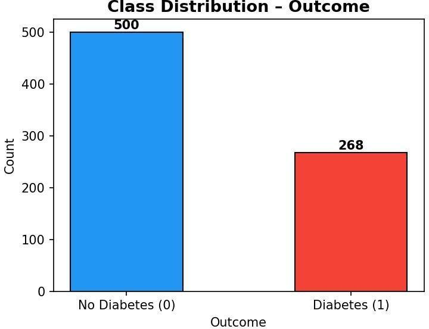
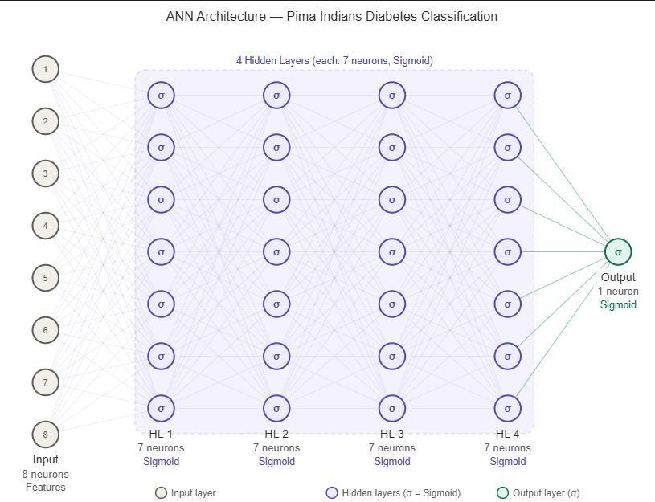
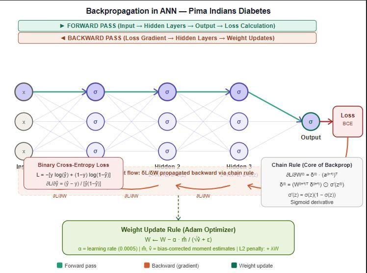
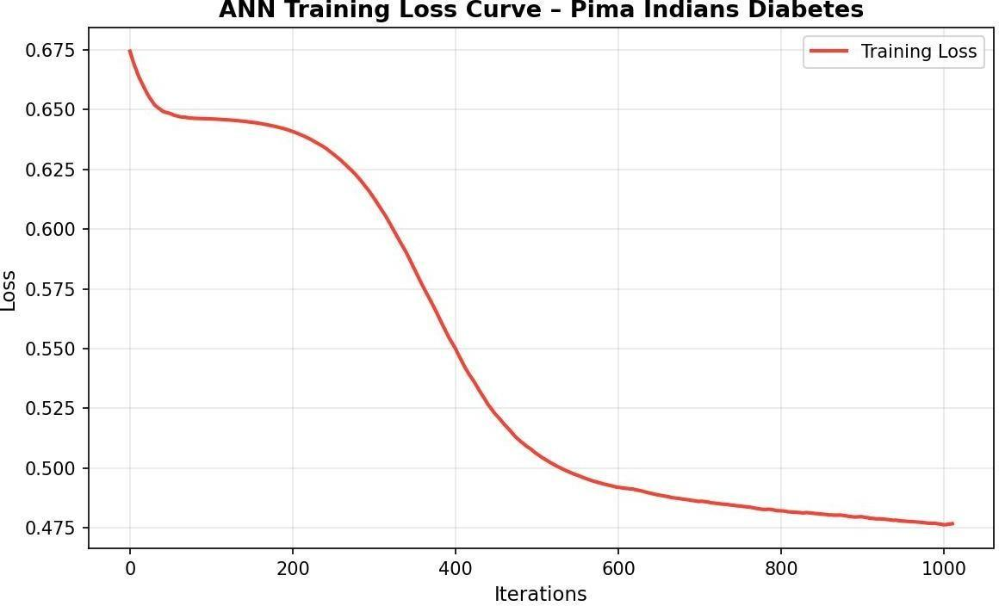
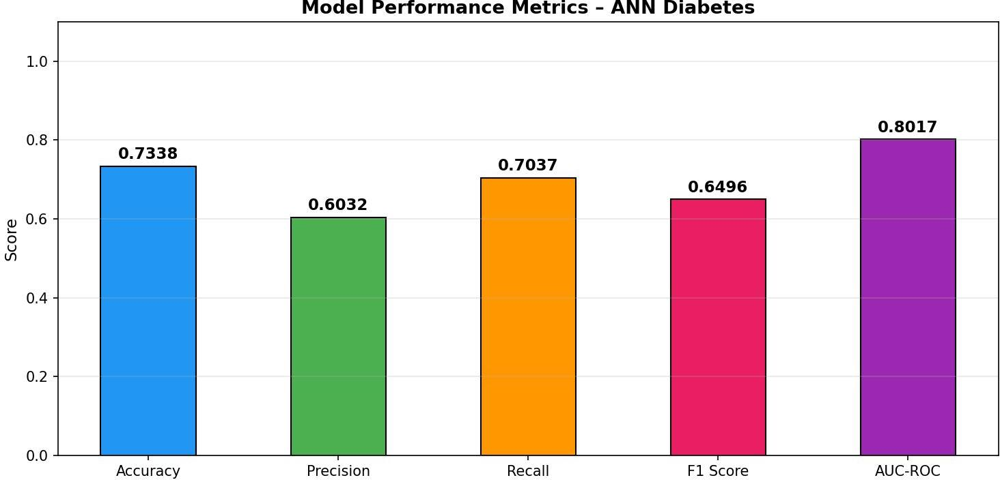
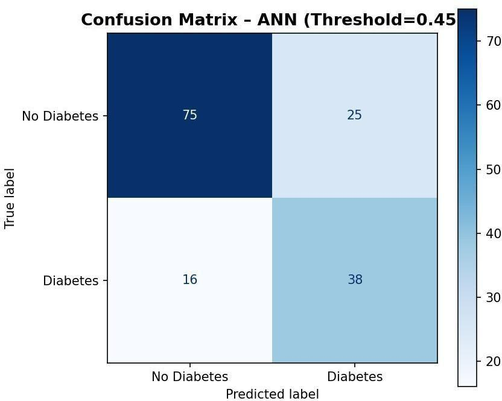
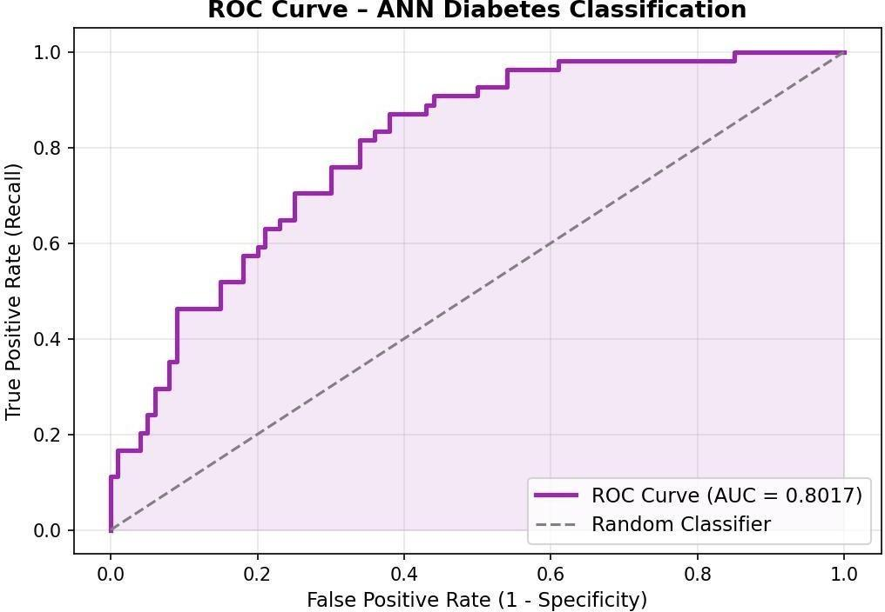
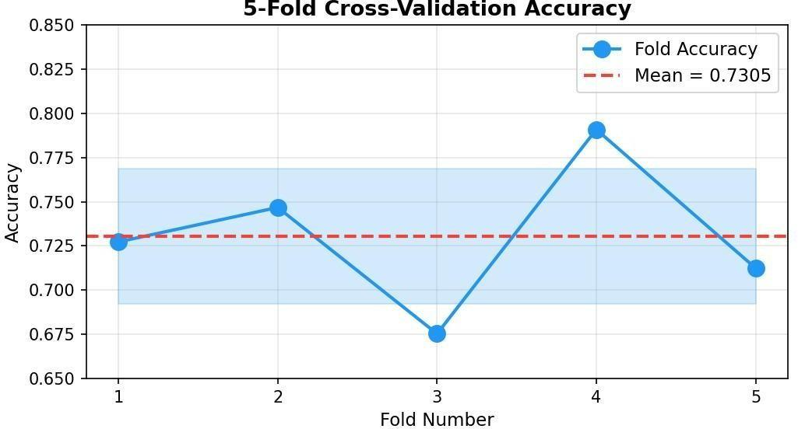
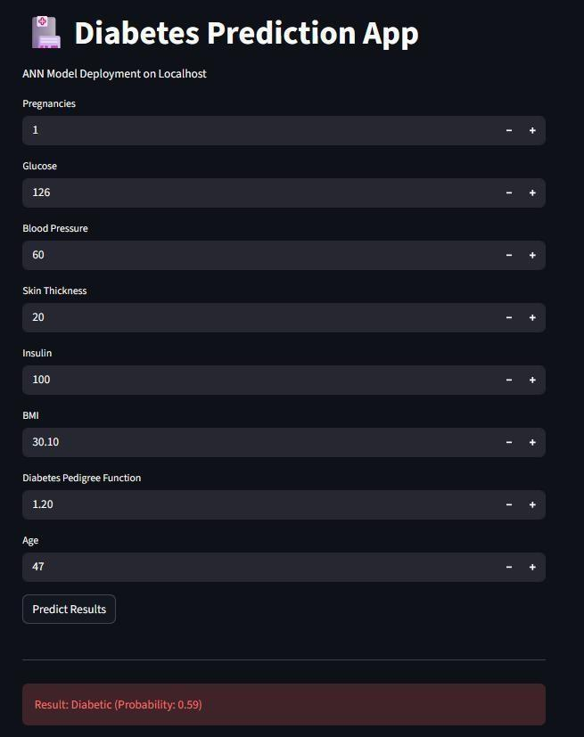
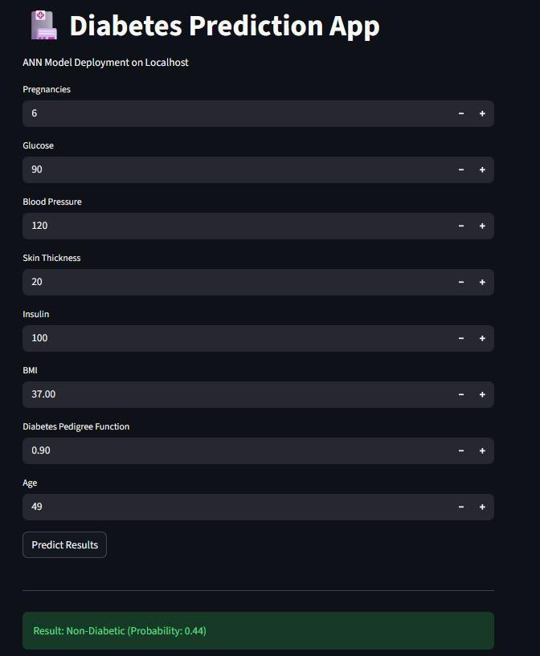

# Diabetes Onset Prediction — ANN Diagnostic Tool

An Artificial Neural Network (ANN) built with scikit-learn's `MLPClassifier` to predict diabetes onset from clinical measurements, using the **Pima Indians Diabetes Dataset**. Built as a CEP (Complex Engineering Problem) project for CS-471: Machine Learning.

## Overview

- **Task:** Binary classification — diabetic vs. non-diabetic
- **Dataset:** Pima Indians Diabetes Dataset (UCI ML Repository / NIDDK), 768 patient records, 8 clinical features
- **Model:** scikit-learn `MLPClassifier` (no TensorFlow/Keras) — 4 hidden layers, 7 sigmoid neurons each
- **Optimizer:** Adam with L2 regularization

## Dataset

768 patient records, with a class imbalance of 500 non-diabetic vs. 268 diabetic cases:



## Architecture

```
Input (8 features) → HL1 (7, sigmoid) → HL2 (7, sigmoid) → HL3 (7, sigmoid) → HL4 (7, sigmoid) → Output (1, sigmoid)
```

| Layer | Neurons | Activation | Parameters |
|---|---|---|---|
| Input | 8 | — | — |
| Hidden 1–4 | 7 each | Sigmoid | 63 + 56 + 56 + 56 |
| Output | 1 | Sigmoid | 8 |
| **Total** | | | **239** |



Training is driven by standard forward propagation and backpropagation with the Adam optimizer:



## Preprocessing

- **Median imputation** for biologically impossible zero values in Glucose, BloodPressure, SkinThickness, Insulin, and BMI
- **IQR outlier clipping** (5th–95th percentile) to prevent sigmoid saturation
- **StandardScaler normalization** (fit on training data only, to avoid data leakage)
- **80/20 stratified train/test split** (random_state=42)

## Results

| Metric | Value |
|---|---|
| Test Accuracy | 73.38% |
| Precision | 60.32% |
| Recall (Sensitivity) | 70.37% |
| F1-Score | 0.6496 |
| AUC-ROC | 0.8017 |
| 5-Fold CV Accuracy | 73.05% ± 3.82% |
| Decision Threshold | 0.45 (precision-optimized) |

**Training loss converged smoothly over 1011 iterations:**



**Performance metrics at a glance:**



**Confusion matrix** (154 test samples, threshold = 0.45):



**ROC curve** — AUC of 0.8017 surpasses the 0.80 clinical benchmark:



**5-fold stratified cross-validation** confirms stable generalization:



Full breakdown and discussion are in [`Project_Report.pdf`](./Project_Report.pdf).

## Demo: Interactive Prediction App

A simple local app was built on top of the trained model to demo predictions on custom patient inputs.

| Diabetic Prediction | Non-Diabetic Prediction |
|---|---|
|  |  |

## Project Structure

```
.
├── diabetes_ann.py     # Full training & evaluation pipeline
├── Project_Report.pdf  # Full project report
├── requirements.txt    # Python dependencies
├── images/             # Figures used in this README
└── README.md
```

## How to Run

1. Clone this repository:
   ```bash
   git clone https://github.com/<your-username>/<repo-name>.git
   cd <repo-name>
   ```

2. Install dependencies:
   ```bash
   pip install -r requirements.txt
   ```

3. Download the [Pima Indians Diabetes Dataset](https://www.kaggle.com/datasets/uciml/pima-indians-diabetes-database) and place `diabetes.csv` in the project folder.

4. Run the script:
   ```bash
   python diabetes_ann.py
   ```

## Limitations

- Precision (60.32%) means roughly 4 in 10 positive predictions are false alarms
- The constrained 4×7 sigmoid architecture (239 parameters) has limited representational capacity
- Insulin feature had ~49% missing values, imputed with medians
- Dataset is limited to female Pima Indian patients aged 21+, limiting generalizability

## References

- Smith, J. W., et al. (1988). *Using the ADAP learning algorithm to forecast the onset of diabetes mellitus.*
- Pedregosa, F., et al. (2011). *Scikit-learn: Machine Learning in Python.* JMLR, 12, 2825–2830.
- Kingma, D. P., & Ba, J. (2015). *Adam: A Method for Stochastic Optimization.* ICLR 2015.
- Dua, D., & Graff, C. (2019). *UCI Machine Learning Repository.*

## Author

CS-471 Machine Learning | CEP Project | Group 06
